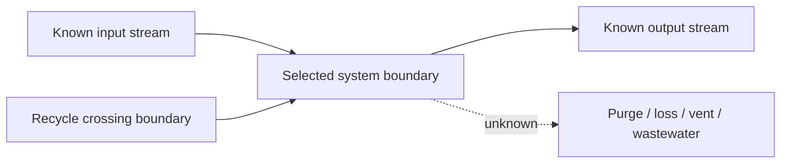

# Output Template

Use this structure for a full chemical modeling prep report.

## 1. Data Inventory and First-Pass Findings

| item | finding | evidence | risk |
|---|---|---|---|
| files |  |  |  |
| time columns |  |  |  |
| sampling interval |  |  |  |
| process tags |  |  |  |
| lab components |  |  |  |
| likely boundary |  |  |  |

## 2. 待确认 List

| priority | question | why it matters | current hypothesis | evidence | owner/status |
|---|---|---|---|---|---|
| P0 |  | blocks formula / changes result |  |  |  |
| P1 |  | affects accuracy or alignment |  |  |  |
| P2 |  | documentation or cleanup |  |  |  |

## 3. Target Definition

| field | definition |
|---|---|
| target name |  |
| target type | measured / calculated / soft-measured / proxy |
| process boundary |  |
| stream or device state |  |
| numerator |  |
| denominator |  |
| unit |  |
| time window |  |
| calculation grade | A/B/C/D |

## 4. Process Boundary Diagram



## 5. Tag and Unit Table

| tag | source | role | equipment_or_stream | raw_unit | inferred_unit | basis | value_range | evidence | status | notes |
|---|---|---|---|---|---|---|---|---|---|---|
|  |  |  |  |  |  |  |  |  |  |  |

## 6. Stream and Component Ledger

| stream | direction | crosses_boundary | total_flow_tag | total_flow_unit | composition_source | composition_basis | components_available | components_missing | component_calculation | known_or_unknown | confirmation_needed |
|---|---|---:|---|---|---|---|---|---|---|---|---|
|  | in/out/internal | yes/no |  |  |  | mass fraction / mole fraction / concentration / pure |  |  |  |  |  |

## 7. Material Balance and Target Formula

State the basis:

```text
time basis = 
mass basis = 
molar basis = 
boundary = 
```

Show total mass balance:

```text
Accumulation = total input - total output + generation_mass - consumption_mass
```

Show component balance:

```text
dN_i/dt = N_i,in - N_i,out + nu_i * r
```

Show target formula:

```text
target = 
```

List every conversion:

| term | raw tags | raw units | conversion | result unit | assumption |
|---|---|---|---|---|---|
|  |  |  |  |  |  |

## 8. Computability Grade and Missing Information

| formula term | grade | reason | minimum information to improve |
|---|---|---|---|
|  | A/B/C/D |  |  |

## 9. Modeling Readiness

| decision | value |
|---|---|
| target ready for modeling | yes/no/conditional |
| acceptable label type | physical target / proxy / scenario label |
| required data cleaning |  |
| required confirmations |  |
| recommended next analysis |  |

## 10. Optional QC Charts

| chart | purpose | file |
|---|---|---|
| flow trends | check operating regimes and gaps |  |
| composition trends | check lab stability and outliers |  |
| ratio trends | check stoichiometric or operating ratio |  |
| computed target | inspect final label |  |
